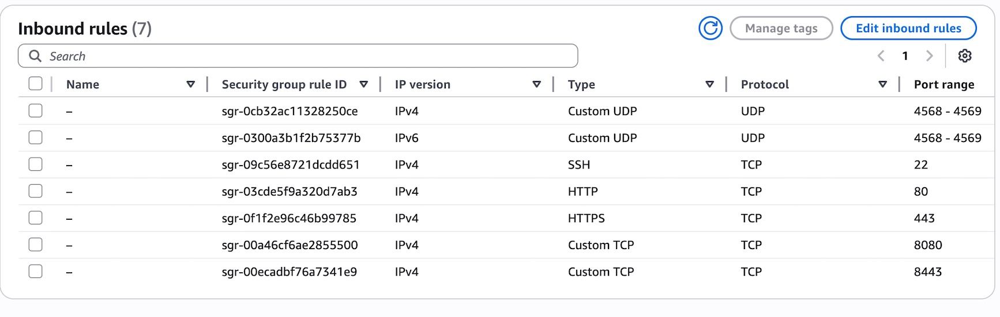

Instructions for deploying the ASL Parrot on AWS. These instructions
are based on a manual deployment. Things will certainly be different for 
a more automated process.

# Some Assumptions I'm Making

* This is a low-volume, low-criticality application. There is no need to be doing
load balancing across redundant copies, etc.
* A single EC2 instance will be used.
* Bruce will be able to redeploy the application independently until it is stable.

# Things You Need To Deploy

These instructions assume you are starting from nothing except:
* The URL of the .deb packages (get that from Bruce)
* The ASL node number and password for the parrot node 
* An AWS account with permissions to create an EC2 instance.

# Steps To Install

Create an EC2 instance:
* Debian 13, arm-64 using t4g-small instance type
* If you don't already have a keypair, create one called "parrot-1"
* If necessary, download the private half of the keypair to ~/.ssh/parrot-1.pem so that you can log in using SSH.
* Choose an appropriate security group for the new instance. Mine is called "Ampersand Server." (See below for specification of Security Group)
* Put the instance in a VPC/subnet that has IPv6 addressing enabled.
* Put the instance on a subnet that has an IPv6 route to the internet.
* Auto-assign an IPv6 IP address to the instance (disabled by default).
* Wait for the instance to come up.

If not created previously, get the public IPv4 address from the EC2 console. Use SSH to log into the new instance as admin:

    ssh -i ~/.ssh/parrot-1.pem admin@13.57.189.175

(The rest of the steps are executed on the new EC2 instance,
all from the admin home directory.)

Add the required Linux packages:

    sudo apt update
    sudo apt -y upgrade
    sudo apt -y install net-tools build-essential gdb cmake git emacs python3.13-venv wget

Get the .deb file:

    wget <url>/asl-parrot_1.2-1_arm64.deb

Install the package:

    sudo apt install asl-parrot_1.2-1_arm64.deb

**Before starting the service** add the secrets to /usr/etc/asl-parrot.env file

    AMP_NODE0_NUMBER=nnnnn
    AMP_NODE0_PASSWORD=xxxx

Enable and start the service:

    sudo systemctl enable asl-parrot
    sudo systemctl start asl-parrot

Check the log:

    journalctl -u asl-parrot.service -f

# Network Configuration

