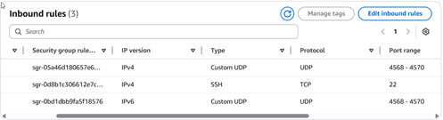

Instructions for deploying the ASL Parrot on AWS. These instructions
are based on a manual deployment. Things will certainly be different for 
a more automated process.

# Some Assumptions I'm Making

* This is a low-volume, low-criticality application. There is no need to be doing
load balancing across redundant copies, etc.
* A single EC2 instance will be used.
* Bruce will be able to redeploy the application independently until it is stable.

# Things You Need To Deploy

These instructions assume you are starting from nothing except:
* The URL of the .deb packages (get that from Bruce)
* The ASL node number and password for the parrot node 
* An AWS account with permissions to create an EC2 instance.

# Special Network Setup Required

This parrot has a network diagnostic feature that will attempt to 
"call back" to a calling node to validate whether its firewall is opened 
properly. This call-back *doesn't involve a full IAX call setup,* but rather
relies on the documented POKE/PONG feature of the IAX protocol. The result
of the network test are announced to the parrot caller. 

In order for this call-back test to be effective it is important that it 
originate from a **different IP address than the parrot uses for its normal
IAX traffic.** Why? Because in the act of calling into the parrot, a node 
opens a temporary/transient UDP hole that allows bi-directional traffic for 
the duration of the parrot session. We don't want the parrot to get tricked
into thinking that this transient UDP hole represent a satisfactory firewall setup.
By running the parrot->caller poke request from a separate public IP address 
it prevents the hole from being used.

The mechanics of this in EC2 are pretty easy: there are two Elastic IP addresses
assigned to the parrot instance, one for normal IAX activity and one for the sole
purpose of network testing. Note that because these two address have different 
security rules they also need to be on different network interfaces.  

# Steps To Install

Network setup:
* Put the instance in a VPC/subnet that has IPv6 addressing enabled.
* Put the instance on a subnet that has an IPv6 route to the internet.
* Create two Security Groups, one that allows IAX/SSH inbound and the
other that is outbound only (for network diagnostics)
* Create two network interfaces, assigned to the two security groups 
respectively. Make a note of the **private IP** of the network interface
intended for network testing - you'll need that later.
* Create two elastic IP addresses, one for normal IAX/SSH activity and 
one for network diagnostics.
* Assign the two IPs to the the two interfaces, respectively.

IAM Setup:
* Create an IAM role for EC2 that grants `AdministratorAccess`. This may be useful
later when you want to run AWS CLI commands.

Create an EC2 instance:
* Debian 13, arm-64 using t4g-micro instance type.
* If you don't already have a keypair, create one called "parrot-1"
* If necessary, download the private half of the keypair to ~/.ssh/parrot-1.pem so that you can log in using SSH.
* Accept the default EBS size of 8G.
* Associate the two network interfaces setup above.
* Associate the IAM role that grants administrator access.
* Wait for the instance to come up.

If not created previously, get the public IPv4 address from the EC2 console. Use SSH to log into the new instance as admin:

    ssh -i ~/.ssh/parrot-1.pem admin@13.57.189.175

(The rest of the steps are executed on the new EC2 instance,
all from the admin home directory.)

Add the required Linux packages:

    sudo apt update
    sudo apt -y upgrade
    sudo apt -y install net-tools build-essential gdb cmake git emacs-nox python3.13-venv wget 

Get the .deb file:

    wget https://ampersand-asl.s3.us-west-1.amazonaws.com/releases/asl-parrot_1.7-1_arm64.deb
    
Install the package:

    sudo apt install ./asl-parrot_1.7-1_arm64.deb

NOTE: There may be a notice displayed that contains "permission denied." If this is 
just a notice it can be ignored.

**Before starting the service** make adjustments /etc/asl-parrot.env file.

Add the secrets here:

    AMP_NODE0_NUMBER=nnnnn
    AMP_NODE0_PASSWORD=xxxx

Change the bind address used for network diagnostic testing to the INTERNAL
IP address associated with the network interface that was setup for network
diagnostics.

    # Network interface (IPv4) that is used to initiate network tests.
    # Needs to be different from the interface accepting IAX connections
    # for the test to be fully effective
    AMP_NET_TEST_BIND_ADDR4=172.31.23.91

Adjust the HTTP listen port (internal VPC only) as needed:

    AMP_HTTP_PORT=8080

And then enable and start the service:

    sudo systemctl enable asl-parrot
    sudo systemctl start asl-parrot

Check the log:

    journalctl -u asl-parrot.service -f

Check the network tests API using curl:

    curl http://localhost:8080/network-test?node=2002

# Network Configuration

# Network Test API 

Example request:
    
    curl http://asl-parrot:8080/network-test?node=2002

Example response (good case):

    {"ipv4":{"addr":"18.226.187.225","pingms":49,"port":4569,"rc":0,"status":"ok"}}

Example response (bad case):

    {"ipv4":{"rc":-9,"status":"unreachable"}}

# Audio Level Prompts

The ASL parrot reports audio level in peak dBFS and average (RMS) dBFS. The "average"
level is really the "maximum average" level across the samples.

The audio level measurement ignores the first and last 300ms to avoid being confused
by clicks/pops associated with key/unkey.

A "laypersons" summary of the peak audio level is also provided. Because there are 
so many opinions on this topic the thresholds are configurable via environment 
variable. See this setting:

    # These are the lower bounds of "very high", "high", "good", and "low".
    # Anything below the last number is "very low".
    AMP_PARROT_LEVEL_THRESHOLDS=-2,-5,-9,-12

Note that each number represents the lower bound (inclusive) of the level. So -2dBFS
is the lower bound of the "very high" level. Anything below -12dBFS will be considered
"very low."

# Program Mode

This was developed at the request of Patrick N2DYI. The feature is enabled
using the AMP_PROGRAM_ROOT environment variable. This variable points 
to the root of a program directory that contains a set of files that will be 
played sequentially with interspersed breaks.

The `announcements` sub-directory contains the intro, outro, and an arbitrary 
number of break files. All of these files have the .txt extension and are 
passed to the text-to-speach engine. The break files start with break0.txt.

The `segments` sub-directory contains an aribtrary number of program segments.
All of these files contain either 8K (.sln), 16K (.s16), or 48K .s48 linear PCM audio 
(little endian format). The segments files start with seg0.sln.

The program proceeds as follows:

* The intro text is spoken.
* There is a 15 second gap (unkeyed)
* For each segment file found:
  - The segment is played
  - The next sequential break text is spoken.
  - There is a 5 second gap (unkeyed)
* The outro text is spoken.

The break text files are recycled as needed. There can be fewer break files than 
segment files.

